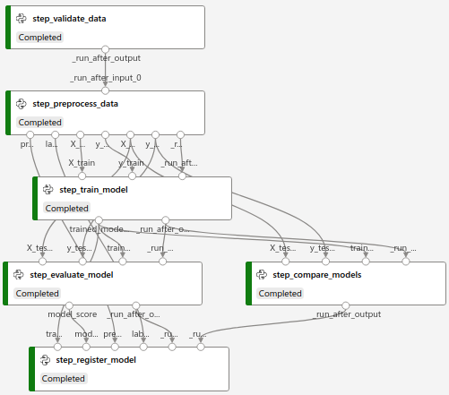
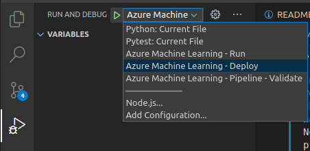

# Heart Disease Classification using AzureML pipelines (MLOps) 
On this project we'll build a heart disease classification using AzureML pipelines (model details [here](./notebooks/model_scratch.ipynb)) (dataset details [here](https://archive.ics.uci.edu/ml/datasets/Heart+Disease) and [here](https://www.kaggle.com/ronitf/heart-disease-uci)). All the pipelines are build using the AzureML SDK and an [AzureML instance](https://ml.azure.com/) with your [Azure account](https://portal.azure.com/). We'll end up with two pieplines:
1. Training pipeline
2. Batch Inference pipeline 

## Training pipeline
The training pipeline is composed of 6 steps:
1. Data validation
2. Data preparation
3. Model training
4. Model evaluation
5. Model comparison
6. Model registration

The **Data Validation** validates the training data, checking for missing columns and data types. The **Data Preparation** preprocess the data and splits it into train and test datasets. The **Model Training** trains the new model. The **Model Evaluation** calculates some metrics, like F1-score and recall, and logs them to the AzureML execution experiment. The **Model Comparison** compares the new model being trained to the latest registered model on AzureML. If the new model's recall metric is greater or equals to the old model, the execution proceeds, if not, it fails and displays an error. The **Model Registration** registers the new model to AzureML.



## Setup the environment

Execute the script `local-setup.sh` to make the automated local setup. Execute the lines of code on the path of your project folder on Linux. Replace `YOUR-AZURE-SUBSCRIPTION` with your Azure subscription:
1. `chmod a+x local-setup.sh`
2. `./local-setup.sh "YOUR-AZURE-SUBSCRIPTION"`

This will install, build and activate the `virtualenv`. It will also install the project required libraries into this virtual environment. At last, it will login to your subscription on azure using the [Azure CLI](https://docs.microsoft.com/en-us/cli/azure/install-azure-cli-linux?pivots=apt). 


Now we will execute the script `create-dotenv-file.sh` to create the environment variables used on this project and save to a hidden file named `.env`. For that you need to replace some values inside this script with the values corresponding to your AzureML instance.

In the file `create-dotenv-file.sh`, you just have to replace the values of the **resource group** and **workspace name** for this project to work. Nonetheless, if you want to use this project as a framework for a custom further development, you can replace the other values as well as create other in this script.
```
RESOURCE_GROUP_NAME="YOUR-AZUREML-RG"
AML_WORKSPACE_NAME="YOUR-AZUREML-NAME"
STORAGE_ACCOUNT_NAME="YOUR-STORAGE"
KV_SERVICE_PRINCIPAL_SECRET_NAME="YOUR-KEY-VAULT-NAME"
AML_VNET_NAME=""
AML_SUBNET_NAME=""
```

Then execute the commands:

1. `chmod a+x create-dotenv-file.sh`
2. `./create-dotenv-file.sh`

If you're using the VSCode IDE, there are some configurations ready for you to use, like the laucher to run, test local files as well as to validate, run and deploy AzureML pipelines on Azure.

